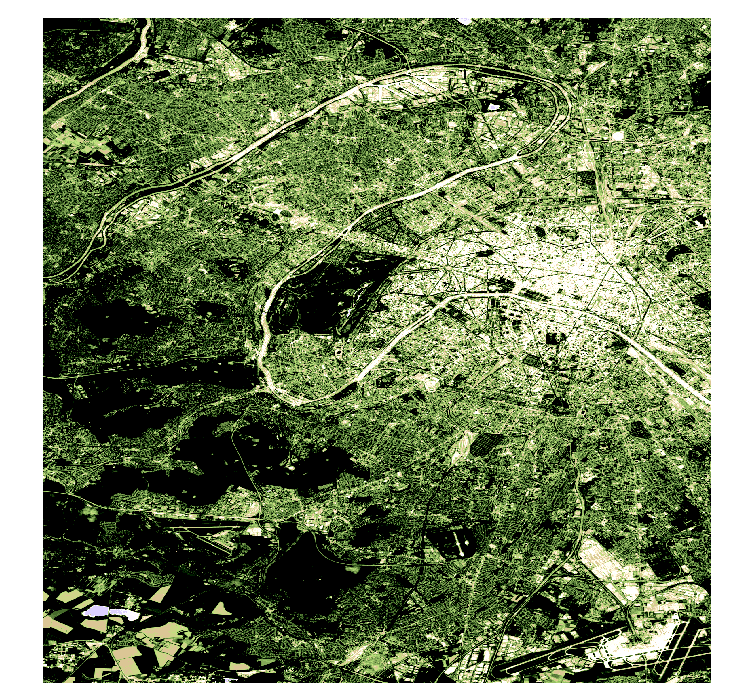

Pour cette étude, nous avons mobilisé trois types de sources afin d'affiner notre analyse spatiale et statistique :

### 1. Données Raster 
Afin d'identifier l'ensemble des surfaces végétalisées du département des **Hauts-de-Seine (92)**, nous avons exploité des images satellite **Sentinel-2** de type NDVI extraites via la plateforme [Copernicus Browser](https://browser.dataspace.copernicus.eu).

   **Le NDVI (Normalized Difference Vegetation Index) :** Il s'agit d'un indice de végétation calculé à partir des bandes spectrales du rouge et de l'infrarouge proche. Il permet de mesurer la vigueur et la densité de la végétation : plus l'indice est proche de 1, plus la végétation est importante.
   **Temporalité :** Données de **2026**.
   **Traitement :** Ces données ont subi un géotraitement raster pour isoler les surfaces végétalisées par rapport au milieu urbain .
   
   **Couche NDVI découper selon les limites du département** : 
   
```{r echo=TRUE, out.width="30%"}

```
---

### 2. Données cadastrales et géographiques

**a) Communes du département**  
Il s'agit de notre zone d'étude regroupant les **36 communes** des Hauts-de-Seine. Extraite de la base [Cadastre Etalab](https://cadastre.data.gouv.fr/datasets/cadastre-etalab), ces données vectorielles nous ont permis de définir les limites administratives, de calculer la surface globale de chaque commune et de réaliser des découpages ainsi que des jointures attributaires.

**b) Espaces naturels**  
Pour affiner l'analyse, nous avons incorporé un jeu de données recensant les **Espaces Naturels ** , gérés par la Direction du Département des Hauts-de-Seine.  
L'objéctif est de comparer la couverture végétale brute (issue du raster) avec les zones officiellement gérées.
   **Source :** [Open Data Hauts-de-Seine](https://opendata.hauts-de-seine.fr/explore/dataset/espaces-naturels-sensibles-ens-et-espaces-naturels-associes-ena/information/), millésime **2021**.
   
   **Répartition des espaces naturels du département des Hauts-de-Seine** : 
   
```{r, echo=TRUE, message=FALSE, warning=FALSE}
library(sf)
library(mapsf)

communes_hds = sf::st_read("communes.shp", quiet = TRUE)
espaces_naturels = sf::st_read("espaces-naturels-sensibles-ens-et-espaces-naturels-associes-ena.shp", quiet = TRUE)
espaces_naturels = sf::st_transform(espaces_naturels, 2154)

mf_theme("default")
mf_map(communes_hds, col = "#f0f0f0", border = "grey", lwd = 0.8)
mf_map(
  x = espaces_naturels,
  col = "forestgreen",
  border = "forestgreen",
  lwd = 0.5,
  add = TRUE
)
mf_layout(title = "Répartition des espaces naturels du département des Hauts-de-Seine", scale = TRUE, arrow = TRUE)
```

---

### 3. Données statistiques

**a) Revenu médian par commune**  
Données extraites de l'**Observatoire des Territoires** (source : Insee/Filosofi, **2021**).  
 Le revenu médian est le niveau de revenu qui partage la population en deux groupes égaux (50 % gagnent plus, 50 % gagnent moins). Il est l'indicateur le plus fidèle pour mesurer le niveau de vie réel des habitants.

**b) Dépenses des collectivités par habitant**  
Jeu de données extrait de l'**OFGL** (Observatoire des Finances et de la Gestion Publique Locale), millésime **2024**.  
 Cet indicateur correspond au montant annuel que la collectivité investit et dépense pour le fonctionnement des services publics par habitant. Il reflète la richesse budgétaire de la commune.
 

---

### Création de l'Indice de Richesse

La combinaison de ces deux sources statistiques nous a permis de classer les communes. Nous avons créé un **indice de richesse** ou les deux variables sont normalisées entre 1 et 0 selon la formule suivante :

```{r echo=FALSE, results='asis'}
cat("
$$\\text{Indice de richesse} = 
\\left(
  \\frac{R - R_{min}}{R_{max} - R_{min}} \\times 0{,}5 \\ + \\ 
  \\frac{D - D_{min}}{D_{max} - D_{min}} \\times 0{,}5
\\right) \\times 100$$
")
```

> Cet indice permet de pondérer la richesse directe des ménages avec la capacité d'investissement de leur commune de résidence.

```{r, echo=TRUE, message=FALSE, warning=FALSE}
library(dplyr)
library(kableExtra)

tab1 = read.csv2("tableau1.csv")
tab1$Insee = as.character(tab1$Insee)

tab2 = read.csv2("tableau2.csv")
tab2$id = as.character(tab2$id)

tab_joint = tab1 |>
  left_join(tab2, by = c("Insee" = "id")) |>
  select(Nom, Montant_par_habitant_2024, Revenu_med) |>
  arrange(Nom)

kable(tab_joint,
  col.names = c("Commune", "Montant par habitant 2024 (€)", "Revenu médian (€)"),
  caption = "Revenu médian et montant par habitant par commune",
  align = c("l", "c", "c")
) |>
  kable_styling(
    bootstrap_options = c("striped", "hover", "condensed", "bordered"),
    full_width = FALSE,
    position = "center",
    font_size = 13
  ) |>
  row_spec(0, bold = TRUE, background = "#2d6a4f", color = "white")
```


