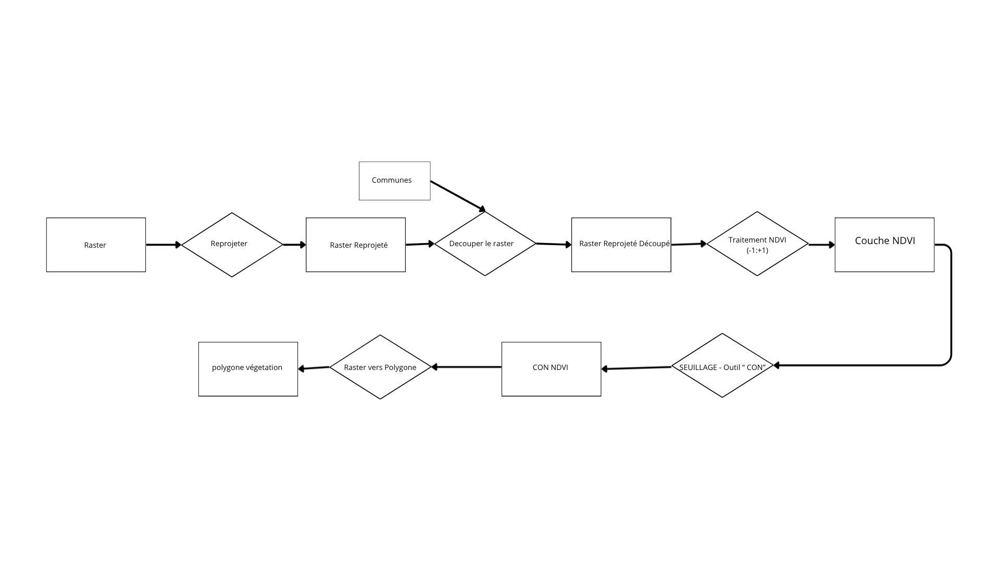
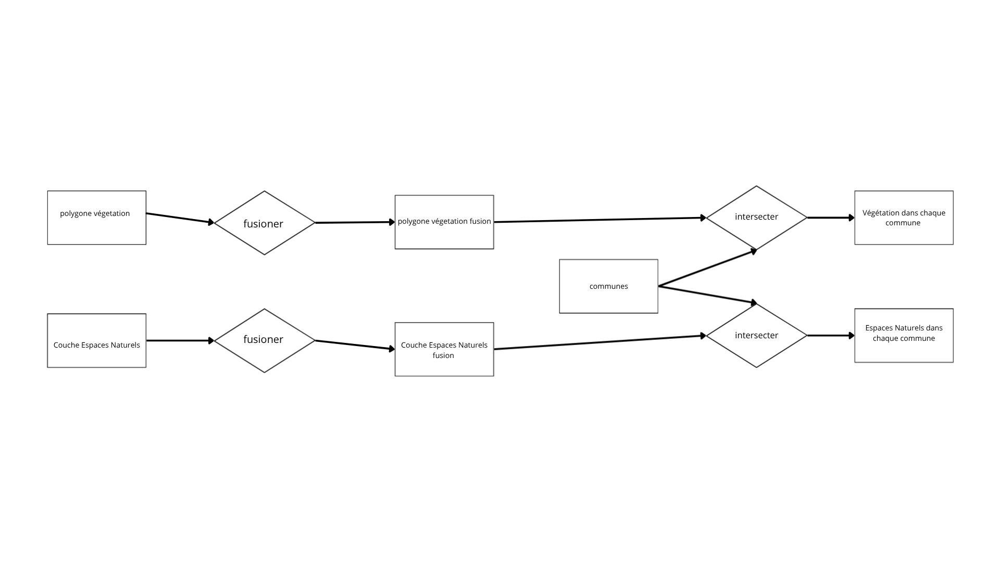
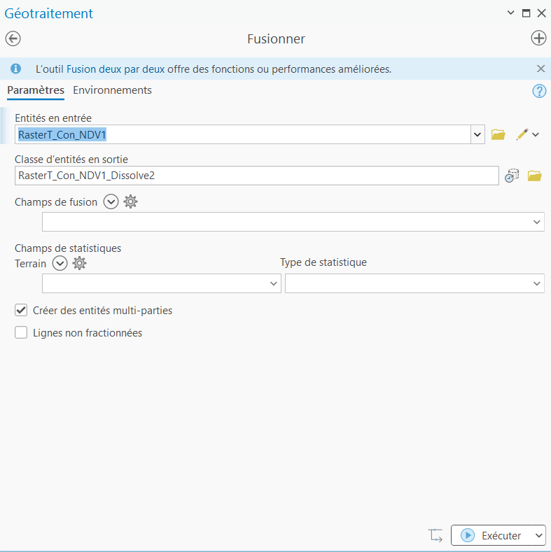
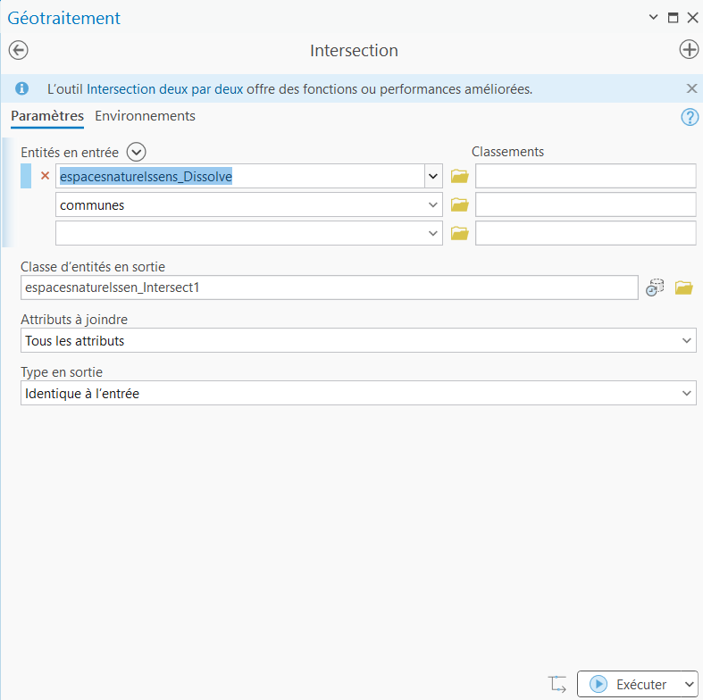

## 1- Géotraitement Raster

**Schéma de géotraitement :**

```{r echo=FALSE, out.width="70%"}

```


*  Dans un premier temps, nous avons reprojeté et découpé l’image NDVI d’après les limites administratives du département des Hauts-de-Seine.


```{r, echo=TRUE, message=FALSE, warning=FALSE}
# CE BLOC CALCULE ET AFFICHE LA CARTE
library(sf)
library(terra)
library(mapsf)

img <- terra::rast("NDVIF.tiff")
communes_hds <- sf::st_read("communes.shp", quiet = TRUE)
hds_contour <- sf::st_transform(communes_hds, 2154) |> sf::st_union()
layer_v <- img[[2]]
hds_terra <- terra::vect(hds_contour)
ndvi_hds <- terra::project(layer_v, sf::st_crs(hds_contour)$wkt) |> 
            terra::crop(hds_terra) |> 
            terra::mask(hds_terra)
stats <- terra::minmax(ndvi_hds)
ndvi_norm <- (ndvi_hds - stats[1]) / (stats[2] - stats[1])
ndvi_final <- 1 - ndvi_norm 

mf_theme("default")
mapsf::mf_raster(x = ndvi_final, pal = mf_get_pal(n = 10, palette = "RdYlGn"), 
                 breaks = "equal", nbreaks = 10, leg_title = "Indice Végétation", leg_val_rnd = 2)
mapsf::mf_map(hds_contour, col = NA, border = "black", lwd = 1.5, add = TRUE)
mf_layout(title = "NDVI découpé", scale = TRUE, arrow = TRUE)

veg_mask <- ndvi_final > 0.6  
veg_mask[veg_mask == 0] <- NA 
poly_veg <- terra::as.polygons(veg_mask) |> sf::st_as_sf()
```

* Enfin, grâce à l’outil « Raster vers polygones », on obtient des polygones qui représentent les espaces végétalisés dans le département des Hauts-de-Seine.


```{r, echo=TRUE, message=FALSE, warning=FALSE}
veg_mask <- ndvi_hds > 0.3

veg_mask[veg_mask == 0] <- NA

poly_veg <- terra::as.polygons(veg_mask, aggregate = TRUE) |> sf::st_as_sf()

mf_theme("default")

mf_map(hds_contour, col = "#f0f0f0", border = "grey")

mf_map(
  x = poly_veg, 
  col = "forestgreen", 
  border = "darkgreen", 
  lwd = 0.5, 
  add = TRUE
)

mf_layout(title = "Zones de végétation vectorisées (Seuil > 0.3)", scale = TRUE)
```


### 2- Géotraitement vecteur

**Schéma de géotraitement :**

```{r echo=FALSE, out.width="70%"}

```


* Les deux couches vecteurs (« Végétation des Hauts-de-Seine » et « Espaces naturels du département ») ont subi le même traitement. Nous avons d’abord fusionné les polygones de ces couches afin d'obtenir une entité unique pour chaque donnée car le géotraitement raster génère des milliers de micro-polygones risquant de créer des erreurs ou des lenteurs de calcul.


```{r echo=FALSE, out.width="20%"}

```


* Ensuite, nous avons intersecté séparément ces couches avec la couche des communes. Cela permet d’obtenir, pour chaque commune, les polygones représentant sa végétation et ses espaces verts propres. À noter que cette intersection facilite également les futures jointures de données.


```{r echo=FALSE, out.width="20%"}

```


**Répartition de la végétation et des espaces naturels dans le 92:**
```{r, echo=TRUE, message=FALSE, warning=FALSE}
library(sf)
library(terra)
library(mapsf)

img <- terra::rast("NDVIF.tiff")
communes_hds <- sf::st_read("communes.shp", quiet = TRUE)
hds_contour <- sf::st_transform(communes_hds, 2154) |> sf::st_union()
layer_v <- img[[2]]
hds_terra <- terra::vect(hds_contour)

ndvi_hds <- terra::project(layer_v, sf::st_crs(hds_contour)$wkt) |>
            terra::crop(hds_terra) |>
            terra::mask(hds_terra)

ndvi_reel = -((ndvi_hds / 65535) * 2 - 1)

mf_theme("default")
mapsf::mf_raster(x = ndvi_reel, pal = rev(mf_get_pal(n = 10, palette = "RdYlGn")),
                 breaks = "equal", nbreaks = 10, leg_title = "Indice Végétation", leg_val_rnd = 2)
mapsf::mf_map(hds_contour, col = NA, border = "black", lwd = 1.5, add = TRUE)
mf_layout(title = "NDVI découpé sur les Hauts-de-Seine", scale = TRUE, arrow = TRUE)
```

```{r, echo=TRUE, message=FALSE, warning=FALSE}
veg_mask = ndvi_reel > 0.3
veg_mask[veg_mask == 0] = NA
poly_veg_temp = terra::as.polygons(veg_mask, aggregate = TRUE)
poly_veg = sf::st_as_sf(poly_veg_temp)

mf_theme("default")
mf_map(hds_contour, col = "#f0f0f0", border = "grey")
mf_map(
  x = poly_veg,
  col = "forestgreen",
  border = "darkgreen",
  lwd = 0.5,
  add = TRUE
)
mf_layout(title = "Zones de végétation vectorisées (Seuil > 0.3)", scale = TRUE)
```
```{r, echo=TRUE, message=FALSE, warning=FALSE}
veg_mask = ndvi_reel > 0.3
veg_mask[veg_mask == 0] = NA
poly_veg_temp = terra::as.polygons(veg_mask, aggregate = TRUE)
poly_veg = sf::st_as_sf(poly_veg_temp)
poly_veg = sf::st_intersection(poly_veg, hds_contour)
mf_theme("default")
mf_map(hds_contour, col = "#f0f0f0", border = "grey")
mf_map(
  x = poly_veg,
  col = "forestgreen",
  border = "darkgreen",
  lwd = 0.5,
  add = TRUE
)
mf_layout(title = "Zones de végétation vectorisées (Seuil > 0.3)", scale = TRUE)
```

```{r, echo=TRUE, message=FALSE, warning=FALSE}
library(sf)
library(mapsf)
library(terra)

communes_hds = sf::st_read("communes.shp", quiet = TRUE)
espaces_naturels = sf::st_read("espaces-naturels-sensibles-ens-et-espaces-naturels-associes-ena.shp", quiet = TRUE)
espaces_naturels = sf::st_transform(espaces_naturels, sf::st_crs(communes_hds))

mf_theme("default")
mf_map(communes_hds, col = "#f0f0f0", border = NA)
mf_map(x = poly_veg, col = "lightgreen", border = "lightgreen", add = TRUE)
mf_map(x = espaces_naturels, col = "forestgreen", border = "forestgreen", lwd = 0.5, add = TRUE)
mf_map(communes_hds, col = NA, border = "black", lwd = 1, add = TRUE)
legend(
  "right",
  legend = c("Espaces végétalisés NDVI > 0.3", "Espaces naturels"),
  fill = c("lightgreen", "forestgreen"),
  border = c("lightgreen", "forestgreen"),
  title = "Légende",
  bty = "n"
)
mf_layout(title = "Répartition des espaces naturels du département des Hauts-de-Seine", scale = TRUE, arrow = TRUE)
```

```{r, echo=TRUE, message=FALSE, warning=FALSE}
library(sf)
library(dplyr)

communes_hds = sf::st_transform(communes_hds, 2154)
espaces_naturels = sf::st_transform(espaces_naturels, 2154)
poly_veg_t = sf::st_transform(poly_veg, 2154)

surface_commune = communes_hds |>
  mutate(surface_commune_ha = as.numeric(sf::st_area(geometry)) / 10000)

inter_veg = sf::st_intersection(poly_veg_t, communes_hds) |>
  mutate(surface_veg_ha = as.numeric(sf::st_area(geometry)) / 10000) |>
  sf::st_drop_geometry() |>
  group_by(nom) |>
  summarise(surface_veg_ha = round(sum(surface_veg_ha), 2))

inter_en = sf::st_intersection(espaces_naturels, communes_hds) |>
  mutate(surface_en_ha = as.numeric(sf::st_area(geometry)) / 10000) |>
  sf::st_drop_geometry() |>
  group_by(nom) |>
  summarise(surface_en_ha = round(sum(surface_en_ha), 2))

tableau = surface_commune |>
  sf::st_drop_geometry() |>
  select(nom, surface_commune_ha) |>
  mutate(surface_commune_ha = round(surface_commune_ha, 2)) |>
  left_join(inter_veg, by = "nom") |>
  left_join(inter_en, by = "nom") |>
  mutate(
    surface_veg_ha = ifelse(is.na(surface_veg_ha), 0, surface_veg_ha),
    surface_en_ha = ifelse(is.na(surface_en_ha), 0, surface_en_ha)
  ) |>
  arrange(nom)

colnames(tableau) = c("Commune", "Surface commune (ha)", "Surface végétation (ha)", "Surface espaces naturels (ha)")

knitr::kable(tableau, caption = "Surface végétation et espaces naturels par commune")
```
---


---