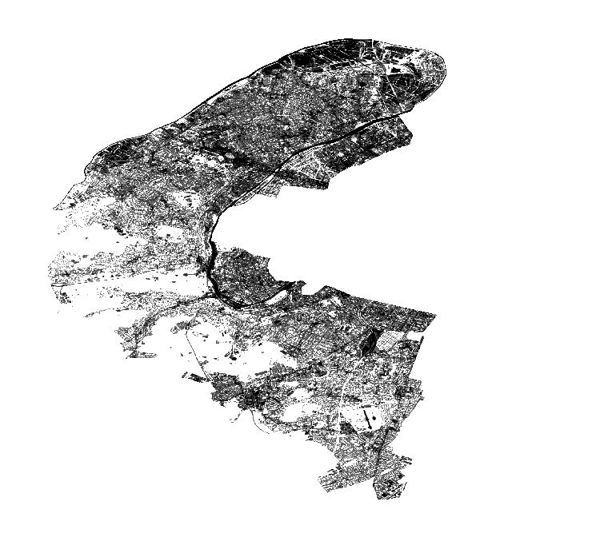
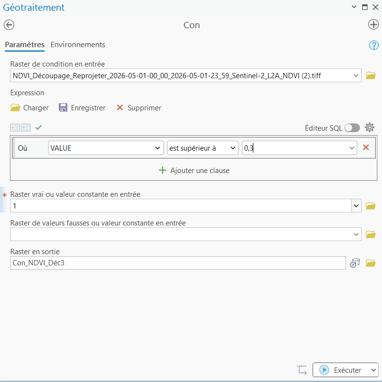
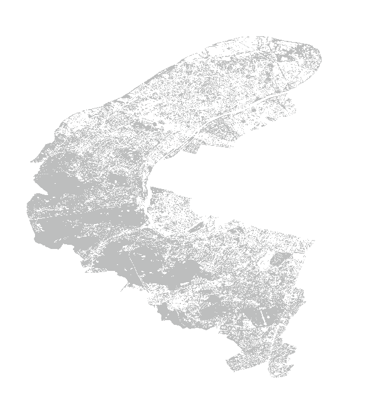
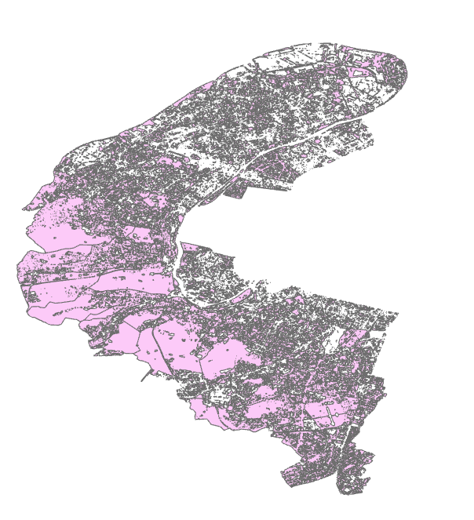

## 1- Géotraitement Raster

**Schéma de géotraitement :**

```{r echo=FALSE, out.width="70%"}
knitr::include_graphics("communes département.png")
```


*  Dans un premier temps, nous avons reprojeté et découpé l’image NDVI d’après les limites administratives du département des Hauts-de-Seine.

```{r echo=FALSE, out.width="30%"}
knitr::include_graphics("ndvicomplet.png")
```
```{r echo=FALSE, out.width="30%"}
knitr::include_graphics("image_ndvi.png")
```


* Puis, grâce à l’outil « Index NDVI », nous avons obtenu une couche dont les valeurs sont comprises entre -1 et +1.

```{r echo=FALSE, out.width="30%"}

```

* Ensuite, grâce à l’outil « Con », nous avons séparé la végétation du reste des sols en lui donnant une seule valeur (vrai) et une autre pour le reste (faux). En effet, la végétation est comprise entre 0,3 et 1 dans la plage de la couche précédente.
```{r echo=FALSE, out.width="20%"}

```
```{r echo=FALSE, out.width="20%"}

```


* Enfin, grâce à l’outil « Raster vers polygones », on obtient des polygones qui représentent les espaces végétalisés dans le département des Hauts-de-Seine.

```{r echo=FALSE, out.width="30%"}

```


### 2- Géotraitement vecteur

**Schéma de géotraitement :**

```{r echo=FALSE, out.width="70%"}
knitr::include_graphics("V1.png")
```


* Les deux couches vecteurs (« Végétation des Hauts-de-Seine » et « Espaces naturels du département ») ont subi le même traitement. Nous avons d’abord fusionné les polygones de ces couches afin d'obtenir une entité unique pour chaque donnée car le géotraitement raster génère des milliers de micro-polygones risquant de créer des erreurs ou des lenteurs de calcul.


```{r echo=FALSE, out.width="20%"}
knitr::include_graphics("V2.png")
```


* Ensuite, nous avons intersecté séparément ces couches avec la couche des communes. Cela permet d’obtenir, pour chaque commune, les polygones représentant sa végétation et ses espaces verts propres. À noter que cette intersection facilite également les futures jointures de données.


```{r echo=FALSE, out.width="20%"}
knitr::include_graphics("V3.png")
```


**Répartition de la végétation et des espaces naturels dans le 92:**

```{r echo=FALSE, out.width="70%"}
knitr::include_graphics("V4.png")
```
---

---