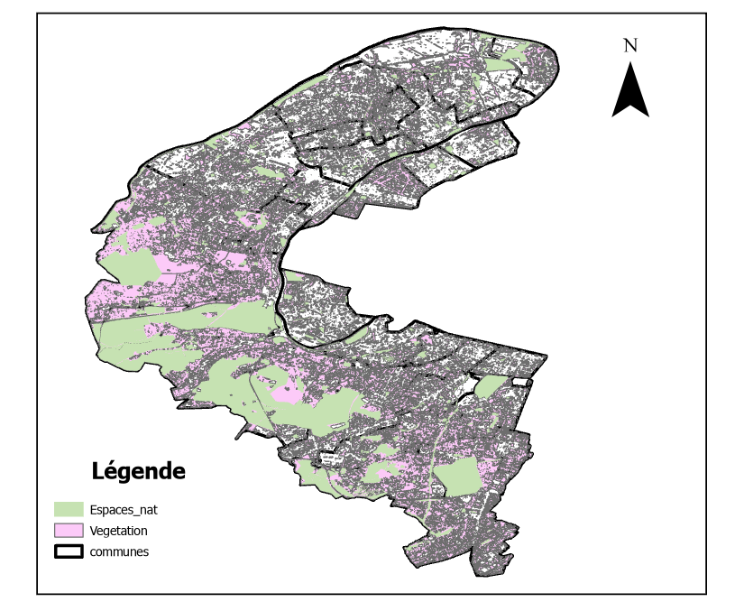

# Projet SIG riche/pauvre : Les espaces verts et la végétation dans les Hauts-de-Seine


**Nom du groupe :** maleug

**Composition du groupe :**

- Simon Meyer-Mommaerts - Rédacteur
- Adel Abdelaziz Zeboudj - Technique


**Sujet du projet :** **Les espaces verts et la végétation sont-ils un marqueur socio-économique ? Cas du département des Hauts-de-Seine**

**Résultats de l'étude:**


**1- RÉPARTITIONS DES ESPACES VERTS ET DE LA VÉGÉTATION AU NIVEAU DES HAUTS-DE-SEINE:**

```{r echo=FALSE, out.width="70%"}

```


**2-CLASSEMENT DES COMMUNES DE LA PLUS RICHE A LA PLUS PAUVRE SUIVANT LE TAUX DE RICHESSE :**

```{r echo=FALSE, message=FALSE}
library(knitr)
library(kableExtra)

df <- data.frame(
  Commune = c("Asnières-sur-Seine","Antony","Bagneux","Bois-Colombes",
              "Boulogne-Billancourt","Bourg-la-Reine","Châtenay-Malabry",
              "Châtillon","Chaville","Clamart","Clichy","Colombes",
              "Courbevoie","Fontenay-aux-Roses","Garches","Gennevilliers",
              "Issy-les-Moulineaux","La Garenne-Colombes","Le Plessis-Robinson",
              "Levallois-Perret","Malakoff","Marnes-la-Coquette","Meudon",
              "Montrouge","Nanterre","Neuilly-sur-Seine","Puteaux",
              "Rueil-Malmaison","Saint-Cloud","Sceaux","Sèvres","Suresnes",
              "Vanves","Vaucresson","Ville-d'Avray","Villeneuve-la-Garenne"),
  Revenu_median = c(28370,32000,21040,21040,35040,33700,27140,30550,32290,
                    29920,22410,25100,32080,26990,36150,18380,33650,33090,
                    31000,34500,25810,41740,30680,30500,21620,48010,30980,
                    32980,39760,36010,33680,31810,30770,41320,38490,18570),
  Montant_par_habitant = c(1825.7,2190.8,2093.1,2137.3,1841.4,2460.1,
                            1926.8,2204.8,1599.7,2487.4,2525.6,2369.7,
                            2651.1,1782.9,2058.3,3949.5,2004.9,2549.3,
                            4959.6,3109.0,1941.8,810.9,1941.8,2220.3,
                            2904.1,3094.4,4212.2,2463.2,2129.9,2489.2,
                            1900.9,2389.7,1834.3,2958.5,1510.9,3067.0)
)

# ── OPTION A : ta formule brute ──────────────────────────────
# df$Indice <- round((df$Revenu_median + df$Montant_par_habitant) / 2, 1)

# ── OPTION B : normalisation min-max (recommandée) ───────────
minmax <- function(x) (x - min(x)) / (max(x) - min(x))

df$Indice <- round(
  (minmax(df$Revenu_median) * 0.5 + minmax(df$Montant_par_habitant) * 0.5) * 100,
  1
)

# ── TRI du plus riche au plus pauvre ─────────────────────────
df <- df[order(-df$Indice), ]

# ── TABLEAU ──────────────────────────────────────────────────
kable(df[, c("Indice", "Commune", "Revenu_median", "Montant_par_habitant")],
      col.names = c("Indice de richesse", "Commune",
                    "Revenu médian (€)", "Dépenses/hab. 2024 (€)"),
      align = c("c", "l", "r", "r"),
      row.names = FALSE,
      format.args = list(big.mark = " ")) %>%
  kable_styling(bootstrap_options = c("striped", "hover", "condensed"),
                full_width = FALSE) %>%
  column_spec(1, bold = TRUE, color = "white",
              background = spec_color(df$Indice, option = "D", direction = 1))
```


**3- D'OCCUPATION DES SOLS PAR LA VÉGÉTATION ET LES ESPACES VERTS POUR CHAQUE COMMUNE**
```{r echo=FALSE, message=FALSE}
library(knitr)
library(kableExtra)
library(dplyr)

# 1. Création du tableau de données
data <- data.frame(
  Commune = c("ANTONY", "ASNIERES-SUR-SEINE", "BAGNEUX", "BOIS COLOMBES",
              "BOULOGNE BILLANCOURT", "BOURG LA REINE", "CHATENAY-MALABRY",
              "CHATILLON", "CHAVILLE", "CLAMART", "CLICHY", "COLOMBES",
              "COURBEVOIE", "FONTENAY AUX ROSES", "GARCHES", "GENNEVILLIERS",
              "ISSY LES MOULINEAUX", "LA GARENNE COLOMBES", "LE PLESSIS ROBINSON",
              "LEVALLOIS PERRET", "MALAKOFF", "MARNES LA COQUETTE", "MEUDON",
              "MONTROUGE", "NANTERRE", "NEUILLY SUR SEINE", "PUTEAUX",
              "RUEIL MALMAISON", "SAINT CLOUD", "SCEAUX", "SEVRES", "SURESNES",
              "VANVES", "VAUCRESSON", "VILLE D AVRAY", "VILLENEUVE LA GARENNE"),
  Surface = c(9.557815146310000, 4.828881626010000, 4.188994688390000, 1.927464962080000,
              6.170325686120000, 1.859911924470000, 6.376546022970000, 2.925581834310000,
              3.578090814820000, 8.763404827870000, 3.079858658790000, 7.804983453470000,
              4.168488241320000, 2.531173572160000, 2.716514273310000, 11.641090557200000,
              4.248017733140000, 1.780541260540000, 3.410721499830000, 2.413411034670000,
              2.073203724340000, 3.484097885630000, 9.957039282000000, 2.066166724280000,
              12.228815774299999, 3.726614340500000, 3.198351501730000, 14.538027503000000,
              7.516335565340000, 3.601167824610000, 3.929845043090000, 3.785670990120000,
              1.556651538610000, 3.098865430920000, 3.690149582010000, 3.199770339990000),
  Surface_EspaceV = c(1.064470254084854, 0.106414037123549, 0.766333917500005, 0.043385853431359,
                      0.316893559260522, NA, 1.952494726220264, 0.086003710844039,
                      1.660489374160722, 2.448317559638556, 0.092738288513823, 0.392472856729701,
                      0.154214474104788, 0.119777886092657, 0.066859373560183, 0.719113212299319,
                      0.365822745208511, 0.005473085067460, 0.447531434415215, 0.103239879347240,
                      0.012330972569705, 2.356784246308874, 4.066845415001946, 0.019561936624372,
                      0.732982882662323, 0.056337349715494, 0.082018530058359, 2.760464413635914,
                      3.068660817568122, 1.200982009962211, 1.068475506084175, 0.243579795622504,
                      0.050451247630547, 0.389692117605131, 2.319894627658148, 0.439069266410887),
  Surface_Veg = c(5.856768581816638, 1.434504185283249, 2.197979569132722, 0.692988897019375,
                  1.908618505614598, 1.016612438634587, 4.929901264831430, 1.220689151417686,
                  2.890318187974107, 5.471686417227625, 0.703339628241229, 2.863817768572616,
                  1.118694271588546, 1.614003410375512, 2.108404460575023, 3.417967072578957,
                  1.562699786543301, 0.528741524730523, 1.864943055536388, 0.470161565542107,
                  0.707071985436374, 3.217172599880343, 7.921902421986929, 0.549183532062959,
                  4.604731653206714, 1.665053053880500, 0.911651772011345, 10.589156985655816,
                  5.913711289172923, 2.791235687512220, 2.961768207883127, 1.888849981018323,
                  0.540645310708275, 2.736644082217525, 3.339756087837356, 1.364182906076096)
)

# 2. Calcul des taux et tri
tableau_final <- data %>%
  mutate(
    Taux_Végétation = (Surface_Veg / Surface) * 100,
    Taux_Espaces_Verts = (Surface_EspaceV / Surface) * 100
  ) %>%
  arrange(desc(Taux_Végétation)) %>%
  select(Commune, Taux_Végétation, Taux_Espaces_Verts)

# 3. Affichage du tableau
kable(
  tableau_final,
  format    = "html",
  digits    = 2,
  col.names = c("Commune", "Taux de Végétation (%)", "Taux d'Espaces Verts (%)"),
  align     = c("l", "r", "r")
) %>%
  kable_styling(
    bootstrap_options = c("striped", "hover"),
    full_width        = TRUE,
    font_size         = 14
  ) %>%
  row_spec(0, bold = TRUE, color = "white", background = "#27AE60")
```


```{r echo=FALSE, message=FALSE}

library(tidyverse)


data <- data.frame(
  Commune = c("ANTONY", "ASNIERES-SUR-SEINE", "BAGNEUX", "BOIS COLOMBES",
              "BOULOGNE BILLANCOURT", "BOURG LA REINE", "CHATENAY-MALABRY",
              "CHATILLON", "CHAVILLE", "CLAMART", "CLICHY", "COLOMBES",
              "COURBEVOIE", "FONTENAY AUX ROSES", "GARCHES", "GENNEVILLIERS",
              "ISSY LES MOULINEAUX", "LA GARENNE COLOMBES", "LE PLESSIS ROBINSON",
              "LEVALLOIS PERRET", "MALAKOFF", "MARNES LA COQUETTE", "MEUDON",
              "MONTROUGE", "NANTERRE", "NEUILLY SUR SEINE", "PUTEAUX",
              "RUEIL MALMAISON", "SAINT CLOUD", "SCEAUX", "SEVRES", "SURESNES",
              "VANVES", "VAUCRESSON", "VILLE D AVRAY", "VILLENEUVE LA GARENNE"),
  
  Revenu_med = c(32000, 28370, 21040, 21040, 35040, 33700, 27140, 30550, 32290,
                 29920, 22410, 25100, 32080, 26990, 36150, 18380, 33650, 33090,
                 31000, 34500, 25810, 41740, 30680, 30500, 21620, 48010, 30980,
                 32980, 39760, 36010, 33680, 31810, 30770, 41320, 38490, 18570),
  
  Surface = c(9.557815, 4.828882, 4.188995, 1.927465, 6.170326, 1.859912, 6.376546, 
              2.925582, 3.578091, 8.763405, 3.079859, 7.804983, 4.168488, 2.531174, 
              2.716514, 11.641091, 4.248018, 1.780541, 3.410721, 2.413411, 2.073204, 
              3.484098, 9.957039, 2.066167, 12.228816, 3.726614, 3.198352, 14.538028, 
              7.516336, 3.601168, 3.929845, 3.785671, 1.556652, 3.098865, 3.690150, 3.199770),
  
  Surface_EspaceV = c(1.064470, 0.106414, 0.766334, 0.043386, 0.316894, 0, 1.952495, 
                      0.086004, 1.660489, 2.448318, 0.092738, 0.392473, 0.154214, 0.119778, 
                      0.066859, 0.719113, 0.365823, 0.005473, 0.447531, 0.103240, 0.012331, 
                      2.356784, 4.066845, 0.019562, 0.732983, 0.056337, 0.082019, 2.760464, 
                      3.068661, 1.200982, 1.068476, 0.243580, 0.050451, 0.389692, 2.319895, 0.439069),
  
  Surface_Veg = c(5.856769, 1.434504, 2.197980, 0.692989, 1.908619, 1.016612, 4.929901, 
                  1.220689, 2.890318, 5.471686, 0.703340, 2.863818, 1.118694, 1.614003, 
                  2.108404, 3.417967, 1.562700, 0.528742, 1.864943, 0.470162, 0.707072, 
                  3.217173, 7.921902, 0.549184, 4.604732, 1.665053, 0.911652, 10.589157, 
                  5.913711, 2.791236, 2.961768, 1.888850, 0.540645, 2.736644, 3.339756, 1.364183)
)


plot_data <- data %>%
  mutate(
    Taux_Végétation = (Surface_Veg / Surface) * 100,
    Taux_Espaces_Verts = (Surface_EspaceV / Surface) * 100
  ) %>%
  dplyr::select(Commune, Revenu_med, Taux_Végétation, Taux_Espaces_Verts) %>%
  pivot_longer(
    cols = c(Taux_Végétation, Taux_Espaces_Verts),
    names_to = "Indicateur",
    values_to = "Pourcentage"
  )


ggplot(plot_data, aes(x = reorder(Commune, Revenu_med), y = Pourcentage, fill = Indicateur)) +
  geom_bar(stat = "identity", position = "dodge", width = 0.8) +
  
  scale_fill_manual(
    values = c("Taux_Espaces_Verts" = "#A3E635", "Taux_Végétation" = "#14532D"),
    labels = c("Espaces Verts", "Végétation (NDVI)")
  ) +
  labs(
    title = "Taux d'occupation des sols des communes des Hauts-de-Seine",
  
    x = "Communes (Revenu médian croissant)",
    y = "Taux d'occupation du sol (%)",
   
  ) +
  theme_minimal() +
  theme(
    axis.text.x = element_text(angle = 45, hjust = 1, size = 5, face = "bold"),
    legend.position = "top",
    panel.grid.major.x = element_blank()
  )
```